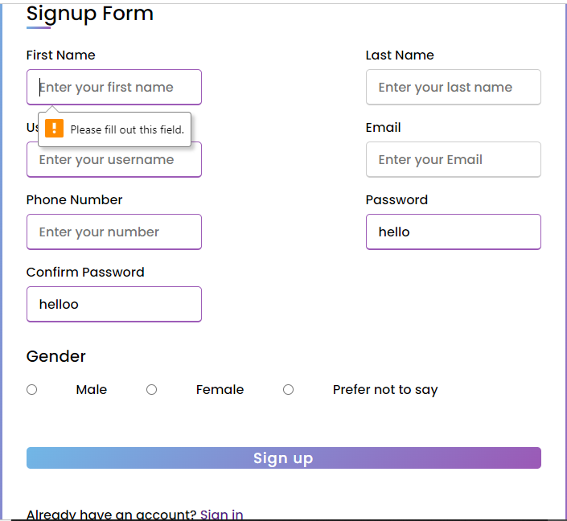
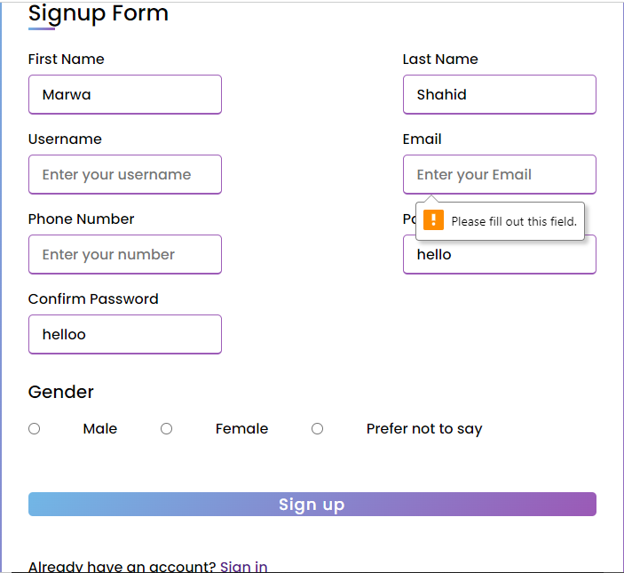
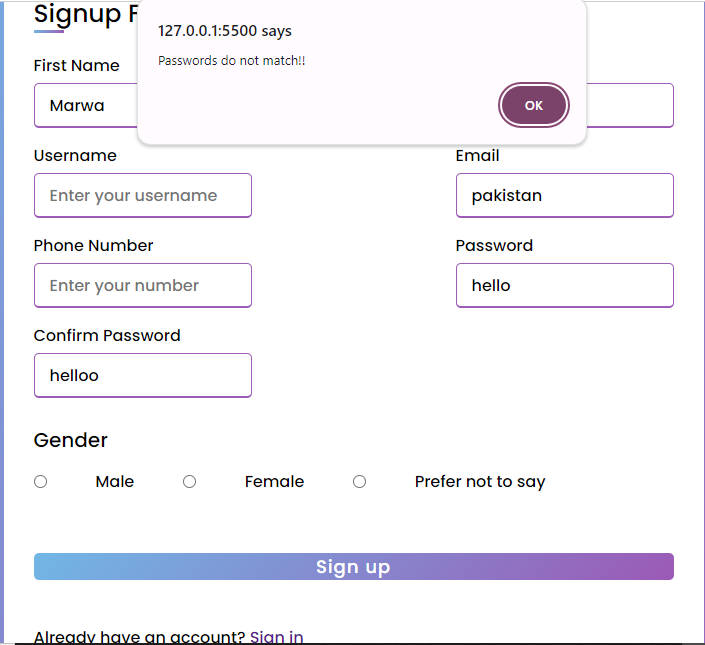
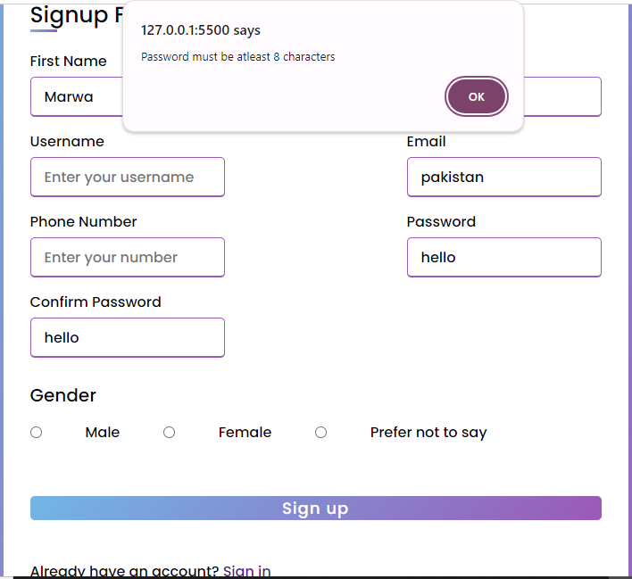
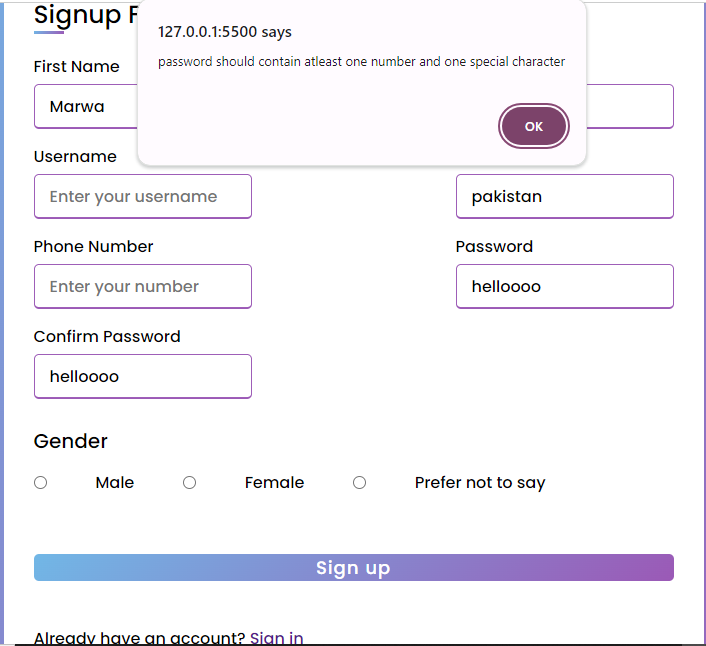
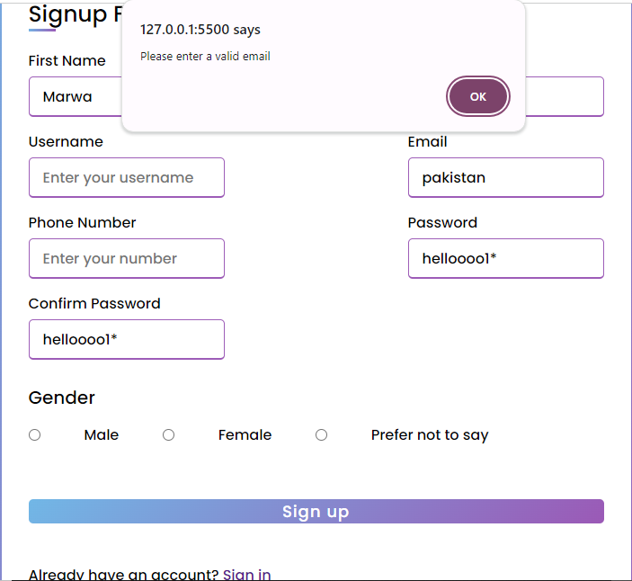

<!DOCTYPE html>
<html>
<h1>HTML and CSS with Validation using JavaScript</h1>
<h6>The following repository contains a Sign-in page and a Sign up page which are designed using basic HTML and CSS.
For validation on various fields , I have used javascript.</h6>

The checks/validation that are applied on the input fields are as follows:
<ul>
  <li>Email: The email must be in the correct format i.e., containing '@' symbol.</li>
  <li>Password: Password must be atleast 8 characters long with atleast one numeric and special character</li>
  <li>Password Confirmation: On the Sign-up page, the input values in new password and confirm password fields must match</li>
  <li>Required fields: Some of the fields including email, password, confirm password and username are made compulsory.</li>
</ul>

<h4>Sign up Page</h4>

<h4>Sign in Page</h4>

  
</html>
